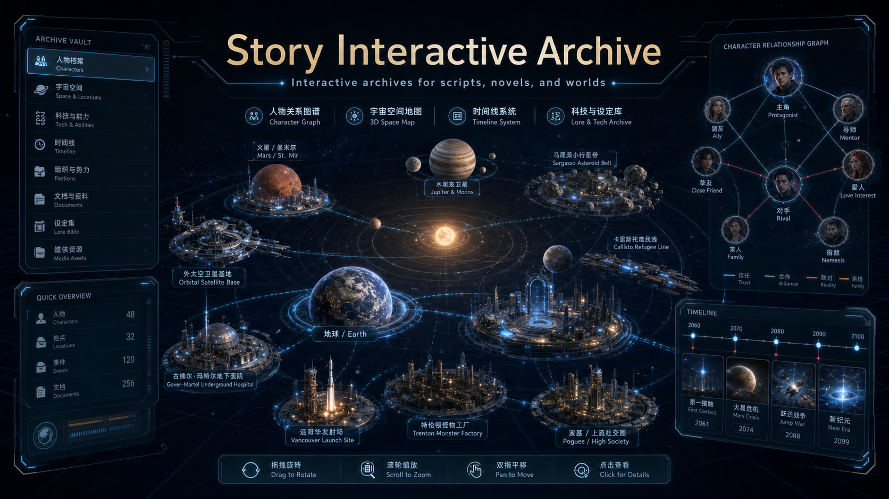
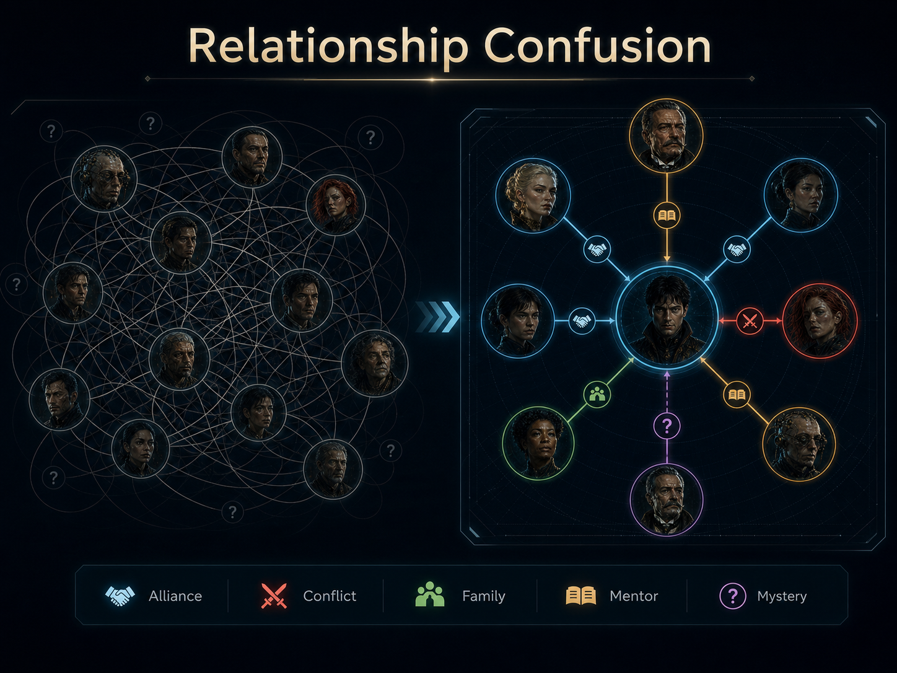
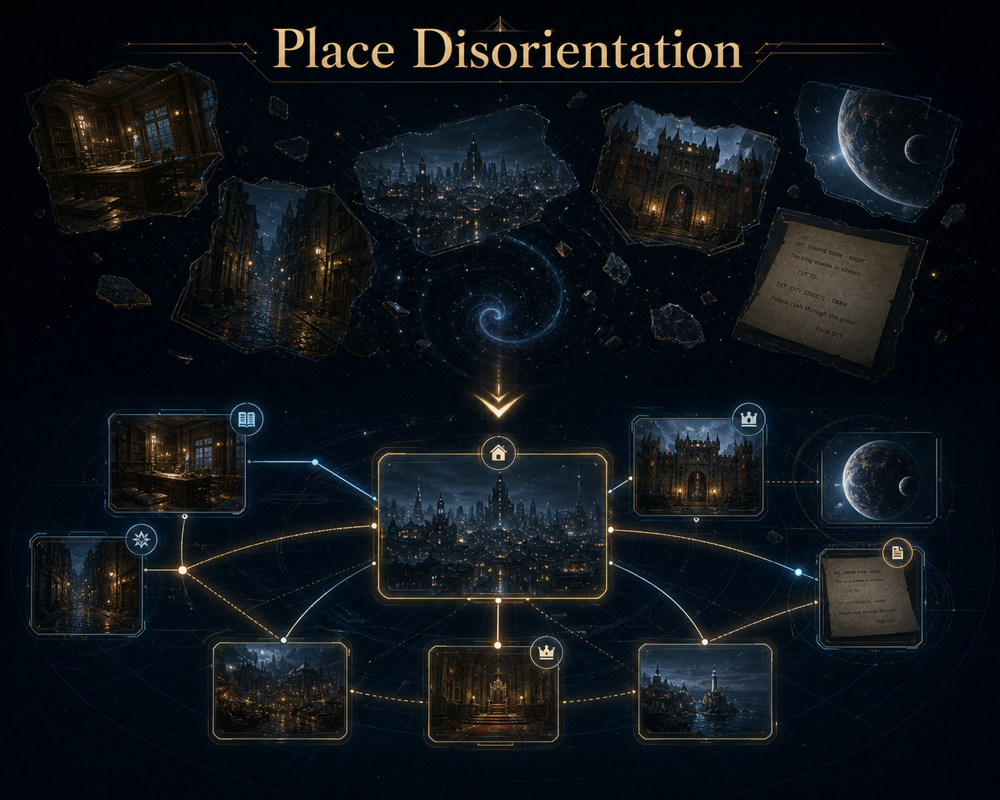
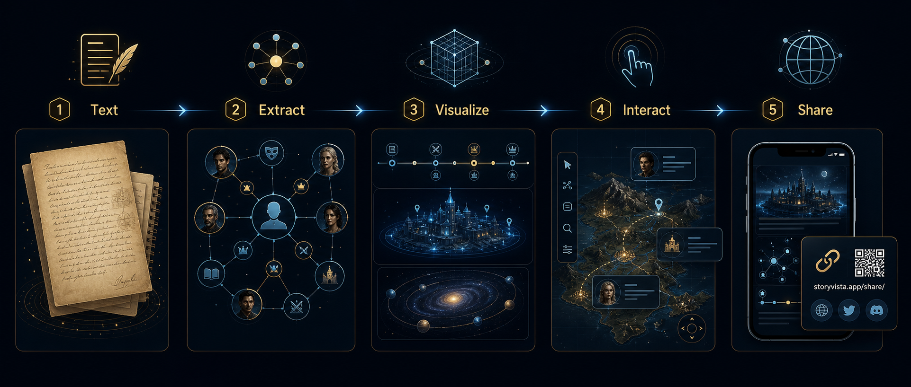

# StoryVista

## Make Text Worlds Visible



[](https://github.com/maikeliu86-coder/story-vista/stargazers)
[](https://github.com/maikeliu86-coder/story-vista/forks)
[](https://github.com/maikeliu86-coder/story-vista/commits/main)
[](https://github.com/maikeliu86-coder/story-vista/issues)

**StoryVista** is a Codex skill for turning complex text worlds into interactive visual story atlases.

Chinese name: **文景**

Chinese tagline: **让文字世界看得见**

Status: **Public beta.** Ready for early users, feedback, examples, and documentation contributions.

StoryVista helps readers, writers, screenwriters, actors, students, researchers, and creative teams transform novels, scripts, screenplays, long-form prose, roleplaying worlds, and dense story notes into visual systems: character maps, relationship trees, scene indexes, location maps, timelines, factions, objects, motifs, concepts, and world structures.

[中文说明 / Chinese README](README.zh-CN.md)

## What is StoryVista?

StoryVista is a reusable Codex skill for making narrative structure visible. It reads source material, identifies narrative entities, separates people from places and objects, and helps build interactive archive pages that a reader or creative team can revisit.

It is not a replacement for literary judgment, script analysis, or human creative decisions. It is a workflow assistant for organizing story material into a clearer visual form.

## Why StoryVista exists

Long narratives are hard to hold in memory. Characters change names, scenes jump locations, objects become important later, factions shift, and timelines split. A screenplay can hide a whole world behind short stage directions and dialogue.

StoryVista turns those scattered clues into a map.


## Visual Pain Points

|  |  |
| --- | --- |
| <br><br>**Name Overload**<br>Too many characters, aliases, translations, titles, and nicknames make it hard to remember who is who.<br><br>**人物名字混乱**<br>人物、别名、译名、头衔和昵称太多，读到后面很容易分不清谁是谁。 | <br><br>**Relationship Confusion**<br>Allies, enemies, families, mentors, rivals, and hidden identities shift across the story.<br><br>**人物关系混乱**<br>同盟、敌对、亲属、导师、竞争者和隐藏身份不断变化，关系线越读越乱。 |
| <br><br>**Place Disorientation**<br>Scenes move between cities, rooms, planets, kingdoms, or timelines before the reader forms a mental map.<br><br>**地点描述混乱**<br>故事在城市、房间、星球、王国或时代之间跳转，读者还没形成地图，场景已经切走。 | <br><br>**Spatial Uncertainty**<br>Routes, distances, worlds, ships, battlefields, or fantasy realms are described in text but hard to visualize.<br><br>**空间关系混乱**<br>路线、距离、世界、飞船、战场或幻想地理只存在于文字里，很难形成直观空间感。 |

## What it can build

- Character relationship maps
- Character indexes with aliases, roles, factions, and summaries
- Scene atlases and scene-by-scene breakdowns
- Location maps and route networks
- Plot, technology, power, object, motif, and symbol timelines
- Faction maps and worldbuilding maps
- Actor preparation boards with character arcs and relationship tensions
- Obsidian-ready local archives
- Static site outputs when the project has a public sharing workflow
- 3D spatial maps when distance, geography, rooms, planets, routes, or movement matter



## What is new in the revised skill

The current StoryVista skill is designed around interactive archives that work across desktop, tablet, and mobile screens.

- **Responsive-first output**: atlas pages should adapt to desktop, tablet, and mobile layouts, with readable names, touch-sized controls, and non-blocking mobile scroll behavior.
- **Text-first entity modeling**: people, places, ships, technologies, powers, organizations, objects, and clues are classified separately before visualization. Ships and locations should not be placed in character graphs.
- **Template inheritance**: when a strong previous atlas exists, StoryVista should inherit its successful layout and interaction logic, then replace the content with the new source material.
- **Cleaner character views**: character overviews use independent portrait cards, relationship trees are grouped by faction or story function when possible, and selected characters highlight their related people and edges.
- **True 3D spatial maps**: planets, ships, cities, bases, stations, routes, and worlds should become miniature 3D models or holographic landmarks, not flat photo cards pasted into a 3D scene.
- **Cross-device 3D gestures**: 3D maps should rotate around the map/grid center, preserve pointer-centered zoom, allow mobile vertical page scrolling, and only intercept intentional horizontal drags or two-finger map gestures.

## Who it is for

- Readers who want to remember complex stories
- Novelists who want to test story structure
- Screenwriters tracking scenes, characters, and locations
- Actors preparing roles, objectives, obstacles, and emotional beats
- Directors and producers coordinating story maps for a team
- RPG and tabletop creators managing lore, factions, maps, and quests
- Teachers and students analyzing literature
- Researchers turning long narrative material into navigable knowledge
- AI workflow builders creating story-visualization pipelines

## Quick Start

Copy the skill folder into your Codex skills directory:

```bash
mkdir -p "$HOME/.codex/skills"
cp -R skill "$HOME/.codex/skills/story-vista"
```

Then invoke it in a new Codex session:

```text
Use $story-vista to turn this novel, script, or long-form text into an interactive visual atlas for characters, relationships, scenes, locations, timelines, and worldbuilding concepts.
```

For more details, see [docs/quickstart.md](docs/quickstart.md).

## Example prompts

```text
Use $story-vista to turn this screenplay into an interactive character relationship atlas.
```

```text
Use $story-vista to build a visual map of factions, locations, objects, and timelines from this fantasy novel.
```

```text
Use $story-vista to analyze this script for actor preparation. Build character relationships, scene objectives, emotional beats, hidden conflicts, and the protagonist's arc.
```

```text
Use $story-vista to convert these worldbuilding notes into a navigable lore atlas.
```

```text
Use $story-vista to create an Obsidian-ready story archive from these notes.
```

```text
Use $story-vista to map every recurring object, motif, symbol, and clue in this mystery novel.
```

```text
Use $story-vista to turn this RPG campaign setting into factions, locations, routes, characters, and timeline views.
```

```text
Use $story-vista to build a 3D spatial map for the places, ships, routes, and worlds in this science-fiction story.
```

More prompts: [docs/prompts.md](docs/prompts.md).

## How it works

1. Reads source material.
2. Identifies narrative entities.
3. Separates people, places, objects, factions, timelines, motifs, and concepts.
4. Builds structured atlas sections.
5. Generates or connects visual assets where appropriate.
6. Validates navigation, image matching, entity consistency, and public sharing links.

## Repository Layout

```text
.
├── README.md
├── README.zh-CN.md
├── assets/
├── docs/
└── skill/
    ├── SKILL.md
    ├── agents/
    │   └── openai.yaml
    └── references/
        └── implementation-notes.md
```

## Design Principles

- Preserve textual evidence over decorative assumptions.
- Do not misclassify cities, ships, objects, organizations, or factions as characters.
- Keep public sharing links distinct from local file paths.
- Verify visual and interactive claims before delivery.
- Use compressed story/world scale when true distances are too large to visualize directly.
- Design for desktop, tablet, and mobile from the beginning.
- Make graph nodes, portraits, 3D model bodies, and labels clickable when they represent explorable entities.
- Avoid fake 3D: do not use flat image stickers, rounded photo cards, or album-wall layouts for spatial maps.

## Quality checklist

- Entity categories are separated before the page is designed.
- Character cards preserve image aspect ratio and do not cover faces with names.
- Character graphs keep relationship labels readable and highlight related nodes on click.
- Timelines explain technologies, powers, weapons, devices, objects, and concepts in story order or first-comprehension order.
- 3D space maps use real model volume, animation, pointer-centered zoom, and clickable model bodies.
- 3D space-map rotation uses the grid/map center instead of an arbitrary node; mobile vertical scroll is not trapped by the map.
- Desktop, tablet, and mobile views are checked before publishing.

## Limitations

- Output quality depends on the clarity and completeness of the source material.
- Long works may need chunking and iterative review.
- Visual generation requires user review, especially for character and location matching.
- Entity extraction may need correction in complex stories with aliases, unreliable narration, or nonlinear timelines.
- StoryVista does not replace literary judgment, script analysis, acting choices, or human creative decisions.

## FAQ

**Is StoryVista only for novels?**

No. It can be used with novels, screenplays, scripts, RPG settings, worldbuilding notes, long-form prose, and dense story notes.

**Can it handle screenplays?**

Yes. It can help map characters, scene objectives, locations, emotional beats, and production-facing story structure.

**Can actors use it for role preparation?**

Yes. StoryVista can help turn a script into a role-preparation atlas: relationships, scene objectives, obstacles, actions, emotional beats, and character arcs.

**Does it generate images?**

It can work with Image2 / GPT-Image workflows when visual assets are requested, but generated images should always be reviewed by the user.

**Does it work with Obsidian?**

Yes. The workflow supports Obsidian-ready local HTML archives and source-record notes.

**Can I publish the output?**

Yes, if you have the rights to the source material and choose a static hosting workflow. Be careful with unpublished, copyrighted, private, or NDA-protected manuscripts.

**Does it work with Chinese texts?**

Yes. StoryVista includes bilingual documentation and can be used for Chinese novels, scripts, and notes.

**How do I contribute?**

Open an issue or pull request with bug reports, templates, documentation improvements, example workflows, or use cases.

## Roadmap

- More example atlases
- Better templates
- More bilingual documentation
- Demo projects
- Optional static site publishing workflow
- More actor, screenwriter, director, and worldbuilder workflows

See [docs/roadmap.md](docs/roadmap.md).

## Contributing

Contributions are welcome: example texts, templates, bug reports, documentation improvements, and new use cases. Start with [CONTRIBUTING.md](CONTRIBUTING.md).

## Security and privacy

Do not paste private manuscripts, unpublished scripts, NDA materials, API keys, sensitive personal data, or local file paths into public issues. See [SECURITY.md](SECURITY.md).

## License

MIT License. See [LICENSE](LICENSE).

## Star StoryVista

If StoryVista helps you understand or visualize a complex story world, consider starring the repository so you can find it again and help others discover it.
