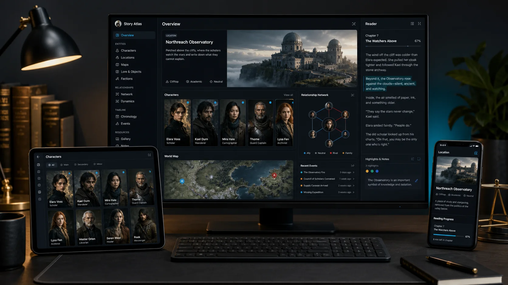

# StoryVista | 文景

**StoryVista is a multilingual visual reading companion for complex novels.**

StoryVista turns complex novels into spoiler-safe visual codexes: character portraits, relationship webs, location maps, object and lore cards, highlighted source text, and an immersive reading panel.

**StoryVista｜文景，是一个面向全球读者的多语言小说视觉化阅读辅助 Skill。**

它把小说中的人物、人物关系、地点、地图、武器、科技、魔法、药剂、特殊物品和世界观设定整理成像游戏图鉴一样的可视化页面，帮助读者读得更清楚、记得更牢、不被剧透。

[中文说明](README.zh-CN.md) · [Skill](skill/SKILL.md) · [Main demo](skill/examples/reader-visual-codex-demo) · [v0.4 provider workflow](docs/external-image-generation.md)

<p align="center">
  
</p>

<p align="center"><em>From source text to a navigable visual story world.</em></p>

## Why StoryVista

StoryVista is designed for readers, students, book clubs, researchers, and worldbuilding fans across languages. It helps readers navigate long names, aliases, relationships, locations, and fictional objects without revealing later plot information.

- **Character Portrait Atlas**: remember who a character is, including titles, aliases, factions, memory labels, and evidence-aware visual profiles.
- **Relationship Web**: inspect A-to-B, A-to-C, and faction relationships with explicit spoiler locks.
- **Story Geography Map**: organize places using canonical facts and clearly labelled interpretive placement.
- **Object & Lore Visual Codex**: make weapons, potions, technology, magic, artifacts, vehicles, creatures, and concepts concrete.
- **Reader Sync Panel**: read the source beside the codex in a collapsible, resizable panel.
- **Entity Highlight & Jump**: click highlighted source entities to open codex entries; jump from evidence back to the source paragraph.
- **Spoiler-Safe Mode**: hide locked relationships and events by default.
- **Visual Provider Preflight**: inspect configured image options, recommend a choice, and fall back without blocking the build.
- **Atmosphere-Aware Theme**: derive a restrained, spoiler-free visual theme and background prompt.
- **Evidence-Based Visual Generation**: separate confirmed, contextual, inferred, and unknown visual claims.
- **Multilingual UI**: English and Simplified Chinese are supported; seven additional locale structures are experimental.
- **Cross-Agent Compatibility**: a plain-file, Python CLI workflow usable by coding agents or directly in a terminal.

## English Quick Start

```bash
python scripts/storyvista.py build skill/examples/reader-visual-codex-demo/input.txt --out output/reader-visual-codex-demo --ui-language auto
python scripts/storyvista.py validate output/reader-visual-codex-demo
```

Open `output/reader-visual-codex-demo/atlas.html`. The default path is offline and dependency-free. It produces a usable atlas plus prompts and semantic display fallbacks; real images can be generated externally and bound later.

## 中文快速开始

```bash
python scripts/storyvista.py build skill/examples/reader-visual-codex-demo/input.txt --out output/reader-visual-codex-demo --ui-language auto
python scripts/storyvista.py validate output/reader-visual-codex-demo
```

在浏览器中打开 `output/reader-visual-codex-demo/atlas.html`。默认流程完全本地运行，并输出可复制的生图提示词；真实图片可在即梦、Seedream 或其他模型中生成后再绑定回来。

## How It Works

<p align="center">
  
</p>

1. Provide a novel, screenplay, or story document.
2. StoryVista extracts characters, locations, relationships, objects, and lore.
3. It creates evidence-aware prompts for API, web, or local image providers.
4. Generate images externally or use a configured provider, then bind the files.
5. Open the responsive visual atlas with Reader Sync, maps, galleries, and spoiler controls.

Override the interface language independently from the source:

```bash
python scripts/storyvista.py build input.txt --out output/demo --ui-language en
python scripts/storyvista.py build input.txt --out output/demo --ui-language zh-CN
```

## Generated Files

The v0.4 build also creates a provider registry, `prompt-pack.md`, provider-specific prompt files, manual generation instructions, expected filenames, and binding-ready manifest records. Semantic SVGs remain display fallbacks while real images are pending.

See the complete contract in [output-spec.md](skill/references/output-spec.md).

## Languages

Input detection currently has tested deterministic paths for English and Simplified Chinese. Japanese, Korean, Russian, Arabic, and Hebrew script detection is structural and experimental; advanced grammar-aware extraction is not claimed.

| UI locale | Status |
| --- | --- |
| `en` | supported |
| `zh-CN` | supported |
| `zh-TW`, `ja`, `ko`, `fr`, `es`, `de`, `ru` | experimental; English fallback fills missing keys |

Canonical names remain in the source language. Localized labels may be added when useful; StoryVista does not force-translate proper nouns.

## Demos

| Demo | Purpose |
| --- | --- |
| `reader-visual-codex-demo` | Full English Reader Visual Codex with aliases, potion, sonic weapon, map, and spoiler lock |
| `english-reader-demo` | Compact English reading example |
| `chinese-reader-demo` | Chinese titles, locations, faction, weapons, and potion |
| `bilingual-demo` | English source with `--ui-language zh-CN` |
| `ancient-chinese-demo` | Ancient Chinese literary theme detection |
| `futuristic-sci-fi-demo` | Futuristic science-fiction theme detection |

## What The Finished Atlas Looks Like

<p align="center">
  
</p>

The generated atlas brings character portraits, location art, relationship networks, maps, lore, reading progress, and highlighted source passages into one responsive interface. Real images replace semantic placeholders after binding, without changing the story data model.

## Visual Provider Preflight

StoryVista checks configuration signals without printing secrets or making paid calls. A detected key is not treated as a verified runtime. With no configured direct provider, the build recommends a practical provider and prepares a prompt workflow; `placeholder-svg` is only the final display fallback while images are pending. Users install, configure, and pay for third-party providers themselves.

```bash
python scripts/detect_image_provider.py --no-network
```

See [visual-provider-preflight.md](docs/visual-provider-preflight.md) and [image-provider recommendations](skill/references/image-provider-recommendations.md).

## Why Am I Seeing Placeholders?

Placeholders mean the atlas is complete but a real image has not yet been bound. Open `prompt-pack.md` or use each card's **Copy prompt** action, generate the image externally, save it with the displayed expected filename, then bind it:

```bash
python scripts/storyvista.py bind-images output/demo --assets output/demo/assets/generated
```

The command updates `image-manifest.json` and rebuilds `atlas.html`. See [manual-image-binding.md](docs/manual-image-binding.md).

## Use Jimeng / 即梦

```bash
python scripts/storyvista.py export-prompts output/demo --provider jimeng
```

Open `output/demo/prompts/jimeng-prompts.md`, copy each Chinese prompt into Jimeng, download each result using its expected filename, place the files in `output/demo/assets/generated/`, and run `bind-images`.

```bash
python scripts/storyvista.py rebuild-atlas output/demo
```

## Use Seedream / SeeDream

```bash
python scripts/storyvista.py export-prompts output/demo --provider seedream
```

Use `output/demo/prompts/seedream-prompts.md` with ByteDance Seedream or Volcengine Seedream. Direct API configuration is represented separately from the manual prompt workflow; StoryVista does not create accounts or make paid calls automatically.

## Cross-Agent Use

Any coding agent that can read files and run Python can invoke the same command. Repository notes cover Codex, Claude Code, Cursor, Qwen Code, Trae, and other global or mainland-accessible tools. These are usage recipes, not claims that every adapter runtime has been tested end to end.

Without an agent, run the CLI directly. No framework is required.

## Source Directives

Plain prose is retained in the Reader panel. Optional English or Chinese directives make deterministic extraction more precise:

```text
Character: Full Name | role | faction | narrative function | aliases | memory label
Location: Name | type | mood | visual keywords | spatial note
Object: Name | category | description | visual keywords
Relation: A -> B | type | polarity | strength | stage | visible/locked
Event: Title | participants | location | summary | visible/locked
```

Chinese labels such as `人物：`, `地点：`, `物品：`, `关系：`, and `事件：` are also supported. Missing or uncertain facts remain unresolved.

## Development

```bash
.venv/bin/python -m pytest -q
.venv/bin/python scripts/storyvista.py validate skill/examples/reader-visual-codex-demo/expected
```

The runtime path uses only the Python standard library. `pytest` is an isolated development dependency.

## Rights and Privacy

Users must have the right to process their source text and images. Unpublished manuscripts and paid books should not be sent to untrusted providers. Local placeholder mode does not upload text. Review [legal-and-rights.md](docs/legal-and-rights.md) before publishing an atlas.

Actor, writer, and director workspaces are no longer core product surfaces. They may return as future extensions after the reader experience is mature.

## License

[MIT](LICENSE)
