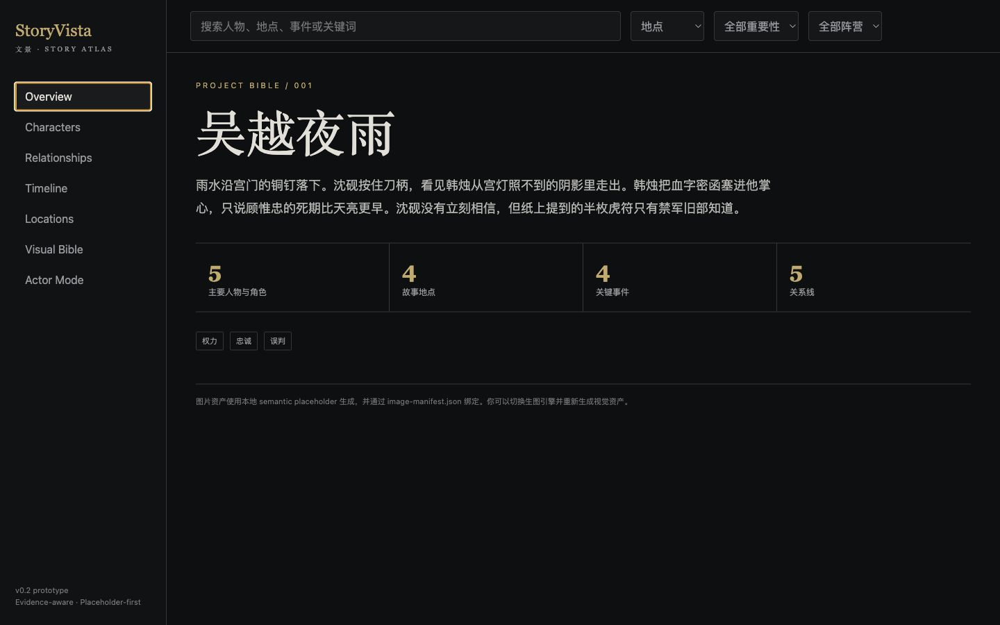
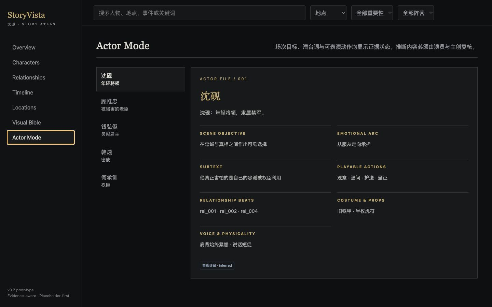

# StoryVista | 文景

**Turn story text into an evidence-aware interactive Story Atlas.**



StoryVista v0.2 is a runnable, dependency-free Python pipeline for novels, scripts, lore, and long-form prose. It creates structured story data, a visual asset plan, semantic placeholders, an image manifest, and a static atlas with Reader and Actor views.

[中文说明](README.zh-CN.md) · [Skill](skill/SKILL.md) · [Minimal demo](skill/examples/minimal-novel-demo) · [Upgrade report](docs/upgrade-report-v0.2.md)

## Run the Demo

```bash
python scripts/storyvista.py build skill/examples/minimal-novel-demo/input.txt --out output/minimal-novel-demo
python scripts/storyvista.py validate output/minimal-novel-demo
```

Open `output/minimal-novel-demo/atlas.html` in a browser. No package install, API key, or image provider is required.

## What It Produces

```text
output/minimal-novel-demo/
├── source-index.json
├── chunks.json
├── story-atlas.json
├── visual-asset-plan.json
├── image-manifest.json
├── assets/placeholders/*.svg
├── atlas.html
└── verification-report.md
```

## Product Surface

- Evidence-aware characters, places, relations, and events
- Searchable Cinematic Bible atlas
- Source quote drawer with confidence and status
- Actor Mode for objectives, subtext, emotional arc, actions, costume/props, and physicality
- Visual Bible for palette, composition, camera language, materials, and exclusions
- Provider-neutral image planning and manifest binding
- Semantic SVG fallback with full names, never silent initials



## Current Status

| Capability | v0.2 status |
| --- | --- |
| UTF-8 ingest and chunking | Runnable |
| Directive-based entity/event extraction | Runnable minimal implementation |
| Evidence records and unresolved states | Runnable |
| Visual asset planning and manifest | Runnable |
| Semantic SVG placeholders | Runnable |
| Static interactive atlas | Runnable |
| Actor Mode | Prototype, evidence-aware |
| External image generation | Optional adapter/manual workflow |
| Advanced NLP, graph layout, 3D maps | Future work |

The minimal extractor intentionally favors explicit source directives and conservative unresolved states. It is not presented as a general-purpose literary reasoning model.

## Input Format

Plain prose works as source material, but optional directives make the deterministic minimal pipeline useful immediately:

```text
人物：沈砚｜年轻将领｜禁军｜protagonist
地点：宫门｜王城入口｜雨夜、压迫｜石阶、宫灯、铁甲
关系：沈砚 -> 顾惟忠｜师徒与救援｜positive｜0.9｜从怀疑到承担
事件：宫门截信｜沈砚、韩烛｜宫门｜韩烛交出血字密函。
```

See the complete fictional demo in [input.txt](skill/examples/minimal-novel-demo/input.txt).

## Image Providers Are Optional

StoryVista separates story modeling from image generation:

| Level | Mode | Result |
| --- | --- | --- |
| 0 | `placeholder-svg` | Local semantic art and complete prompts |
| 1 | `manual-assets` | User-generated or supplied images bound by manifest |
| 2 | callable provider | Adapter generates assets from the visual plan |

Run a non-network diagnosis with:

```bash
python scripts/detect_image_provider.py --no-network
```

StoryVista can recommend mainland-accessible and global options, but it does not install providers or create paid accounts. See [image-provider.md](skill/references/image-provider.md).

## Data Contracts

JSON Schemas are in [skill/templates](skill/templates): source index, chunks, story atlas, visual asset plan, image manifest, and agent adapter. Stable IDs and evidence states keep extraction, UI, and future adapters decoupled.

## Verify

```bash
python -m unittest discover -s tests -v
python scripts/storyvista_validate.py output/minimal-novel-demo
```

Validation covers files, JSON, relation endpoints, evidence state, unique assets, manifest bindings, placeholder paths, portrait coverage, and the no-initials policy.

## Cross-Agent Use

The core is plain files plus Python. Codex, Claude Code, Cursor, Copilot, Qwen Code, MiniMax, Hunyuan, AgentBuilder, CrewAI, LangChain, LlamaIndex, and smolagents can invoke the same CLI or follow the same six-step contract. Platform notes live in [skill/agents](skill/agents).

## Rights and Privacy

Source text is processed locally by the minimal pipeline. Users must have rights to process source material and use any external generated or supplied images. Do not expose API keys or upload confidential manuscripts without authorization. See [legal-and-rights.md](docs/legal-and-rights.md).

## Roadmap

v0.2 establishes the runnable baseline. Next priorities are richer extraction adapters, provider plugins, graph visualization, public-domain demos, and optional advanced maps. See [roadmap.md](docs/roadmap.md).

## License

[MIT](LICENSE)
